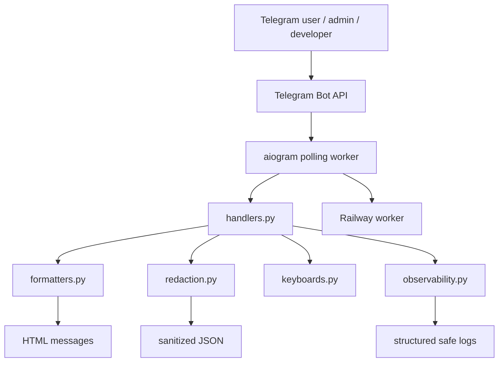
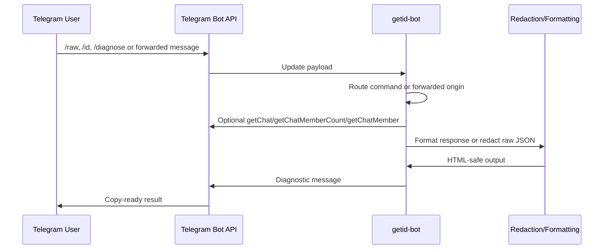
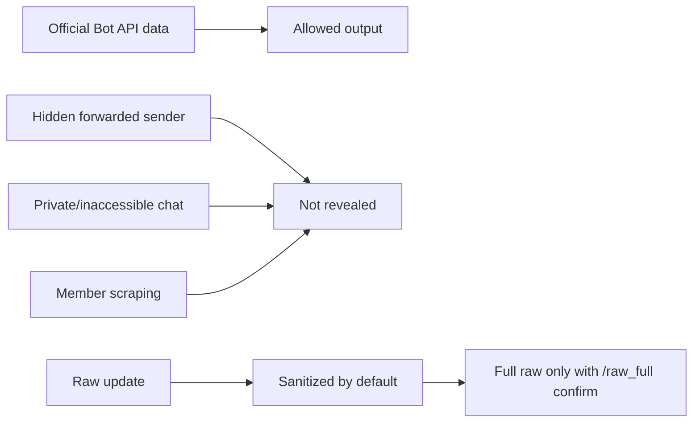
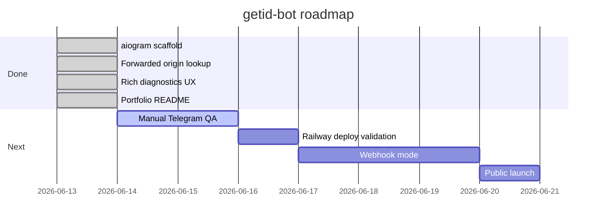

<div align="center">

# getid-bot

**Open-source Telegram diagnostics bot for IDs, chats, channels, forum topics, forwarded origins and raw Bot API updates.**  
**Открытый Telegram-бот для диагностики ID, чатов, каналов, форум-топиков, forwarded origins и raw Bot API updates.**

[](https://www.python.org/)
[](https://aiogram.dev/)
[](https://docs.astral.sh/uv/)
[](https://railway.com/)
[](https://docs.astral.sh/ruff/)
[](https://docs.pytest.org/)

[English](#english) | [Русский](#русский) | [Architecture](#architecture) | [Railway](#railway-deployment) | [Docs](#documentation)

</div>

---

## English

`getid-bot` is a privacy-first Telegram diagnostics bot for developers, channel admins, community operators and support teams.

It answers a simple question very well:

> What information does Telegram Bot API actually expose about this user, chat, channel, topic or forwarded message?

The bot is intentionally transparent. It does not scrape members, deanonymize users, bypass privacy settings or pretend to know fields Telegram does not expose.

### Product Positioning

| Audience | Job To Be Done | Bot Value |
| --- | --- | --- |
| Bot developers | Get user/chat/channel/topic IDs quickly | Copy-ready IDs, raw update JSON, privacy explanations |
| Group and channel admins | Diagnose bot access and chat metadata | `/id`, `/diagnose`, member count, bot status |
| Support teams | Ask users for safe Telegram identity data | `/support_card`, minimal identity card |
| Community operators | Inspect forwarded channel/chat origins | Forwarded origin lookup and `getChat` enrichment |
| Debugging workflows | Understand Telegram update payloads | Sanitized `/raw` and explicit `/raw_full confirm` |

### Highlights

- Private identity lookup with `/start`.
- Current chat, message and forum topic diagnostics with `/id`.
- Forwarded user, hidden user, chat and channel origin lookup.
- Public `@username` lookup through Telegram `getChat`.
- Rich `/diagnose` flow with `getChat`, `getChatMemberCount` and bot admin status.
- Sanitized raw update output through `/raw`.
- Explicit unredacted output through `/raw_full confirm`.
- Inline onboarding buttons for My ID, Help, Contact lookup, Raw JSON and GitHub.
- Structured privacy-safe logs without raw payloads.
- Railway-ready polling worker deployment.
- Full user and launch documentation.

---

## Русский

`getid-bot` - privacy-first Telegram-бот для разработчиков, админов каналов и групп, операторов комьюнити и саппорт-команд.

Он хорошо отвечает на один главный вопрос:

> Какие данные Telegram Bot API реально отдает о пользователе, чате, канале, топике или пересланном сообщении?

Бот не занимается scraping, deanonymization, обходом privacy-настроек и не пытается угадывать скрытые поля. Если Telegram не отдал данные, бот говорит об этом прямо.

### Позиционирование

| Аудитория | Задача | Ценность бота |
| --- | --- | --- |
| Разработчики ботов | Быстро получить user/chat/channel/topic ID | ID в copy-ready формате, raw JSON, объяснение лимитов |
| Админы групп и каналов | Проверить доступы и metadata чата | `/id`, `/diagnose`, member count, bot status |
| Саппорт-команды | Безопасно идентифицировать пользователя | `/support_card`, минимальная карточка пользователя |
| Операторы комьюнити | Проверить origin пересланного канала/чата | Forwarded origin lookup и `getChat` enrichment |
| Debug workflows | Понять Telegram update payload | Sanitized `/raw` и явный `/raw_full confirm` |

### Возможности

- `/start` показывает Telegram identity пользователя.
- `/id` показывает chat ID, message ID и forum topic ID.
- Forwarded contact lookup показывает доступные данные о пересланном пользователе, скрытом пользователе, чате или канале.
- Lookup публичного `@username` через Telegram `getChat`.
- `/diagnose` проверяет `getChat`, `getChatMemberCount`, статус бота и admin rights.
- `/raw` показывает sanitized raw Telegram update JSON.
- `/raw_full confirm` показывает unredacted raw JSON только после явного подтверждения.
- Inline-кнопки в onboarding: My ID, Help, Contact lookup, Raw JSON, GitHub.
- Privacy-safe structured logs без raw payloads.
- Готовая конфигурация для Railway.
- Документация для пользователей, запуска и BotFather.

---

## Feature Matrix

| Feature | Command / Flow | Status | Privacy Notes |
| --- | --- | --- | --- |
| User identity | `/start` | Ready | Shows only fields Telegram exposes |
| Chat ID | `/id` | Ready | Works where bot receives messages |
| Forum topic ID | `/id` inside topic | Ready | Requires `message_thread_id` in update |
| Forwarded user lookup | Forward message | Ready | Hidden users remain hidden |
| Forwarded channel lookup | Forward channel post | Ready | Enriched through `getChat` when allowed |
| Public username lookup | Send `@username` | Ready | Public/inaccessible limits apply |
| Raw update JSON | `/raw` | Ready | Redacts sensitive fields by default |
| Full raw update JSON | `/raw_full confirm` | Ready | Explicit confirmation required |
| Permission diagnostics | `/diagnose` | Ready | Shows unavailable checks instead of failing |
| Support identity card | `/support_card` | Ready | Minimal identity data only |
| Webhook mode | N/A | Planned | Current deployment uses polling |

## Commands

Recommended BotFather command list:

```text
start - Show your Telegram identity and quick actions
id - Show current chat, message and topic IDs
contact - Inspect a forwarded user, chat or channel
raw - Show sanitized raw Telegram update JSON
raw_full - Show unredacted raw JSON after explicit confirmation
diagnose - Explain permissions and privacy mode
support_card - Create a minimal support identity card
help - Show all bot capabilities
help_user_id - How to get Telegram user ID
help_group_id - How to get Telegram group ID
help_channel_id - How to get Telegram channel ID
help_topic_id - How to get forum topic ID
help_privacy - Why bots cannot see some messages
```

## Architecture



### Request Flow



### Privacy Boundary



## Stack

| Layer | Technology | Purpose |
| --- | --- | --- |
| Runtime | Python 3.11+ | Application runtime |
| Telegram framework | aiogram 3.x | Bot routing, Bot API types, polling |
| Settings | pydantic-settings | Environment-based configuration |
| Package manager | uv | Dependency locking and local execution |
| Tests | pytest, pytest-asyncio | Unit tests and async-ready test setup |
| Linting | Ruff | Fast Python linting |
| Deployment | Railway + Nixpacks | Worker deployment |

## Dependencies

Runtime dependencies:

```toml
aiogram = ">=3.16,<4"
pydantic-settings = ">=2.7,<3"
```

Development dependencies:

```toml
pytest = ">=8.3,<9"
pytest-asyncio = ">=0.25,<1"
ruff = ">=0.8,<1"
```

## Project Structure

```text
src/getid_bot/
  bot.py           # aiogram bot startup
  config.py        # environment settings
  handlers.py      # Telegram command and message handlers
  keyboards.py     # inline onboarding controls
  formatters.py    # HTML response formatting
  help_texts.py    # built-in help and warning texts
  observability.py # structured privacy-safe logs
  redaction.py     # raw update redaction
tests/
  test_formatters.py
  test_redaction.py
docs/
  user-guide.md    # user-facing documentation
  launch.md        # BotFather and launch materials
```

## Local Development

Install dependencies:

```bash
uv sync --extra dev
cp .env.example .env
```

Set your bot token:

```env
BOT_TOKEN=123456:replace-me
LOG_LEVEL=INFO
BOT_PARSE_MODE=HTML
```

Run the bot:

```bash
uv run getid-bot
```

Run checks:

```bash
uv run pytest
uv run ruff check .
```

Current verification:

```text
12 tests passing
Ruff checks passing
```

## Railway Deployment

The app currently runs as a polling worker. It does not need a public HTTP domain.

Required variable:

```text
BOT_TOKEN=...
```

Recommended variables:

```text
LOG_LEVEL=INFO
BOT_PARSE_MODE=HTML
```

Railway starts the worker with:

```bash
uv run getid-bot
```

Deployment files:

| File | Purpose |
| --- | --- |
| `railway.json` | Railway/Nixpacks deployment settings |
| `Procfile` | Worker process declaration |
| `runtime.txt` | Python runtime hint |
| `.env.example` | Environment template |

## Raw Output And Redaction

`/raw` redacts sensitive fields before sending JSON back to Telegram:

- Bot tokens.
- Invite links.
- Phone numbers.
- Email addresses.
- Message text and captions.
- Web app callback data and generic callback data.
- Payment, order and passport fields.
- Telegram file identifiers and direct URL fields.

`/raw_full confirm` exists for deliberate debugging sessions where unredacted JSON is required.

## Observability

The bot logs structured command events without raw payloads:

```json
{
  "event": "command",
  "chat_type": "private",
  "chat_id": "123456789",
  "message_id": 42,
  "command": "diagnose"
}
```

Logs must not include raw updates, message text, phone numbers, usernames, invite links or bot tokens.

## Telegram Privacy Boundaries

The bot cannot:

- Fetch arbitrary private users by ID.
- Reveal hidden forwarded sender IDs.
- Scrape group members.
- Discover hidden profiles.
- Bypass BotFather privacy mode.
- Access private channels or groups where the bot has no access.
- Guarantee optional fields such as Premium status are always present.

This is a product rule, not only a technical limitation.

## Documentation

| Document | Description |
| --- | --- |
| [`docs/user-guide.md`](docs/user-guide.md) | User-facing guide for IDs, forwarded origins, raw updates and diagnostics |
| [`docs/launch.md`](docs/launch.md) | BotFather description, command list, launch post and checklist |
| [`MARKET_ANALYSIS.md`](MARKET_ANALYSIS.md) | Market research and positioning |
| [`AGENTS.MD`](AGENTS.MD) | Agent-facing project instructions |
| [`SKILLS.MD`](SKILLS.MD) | Project skill map |
| [`CODEX_PROMPT.md`](CODEX_PROMPT.md) | Build prompt for future Codex work |

## Roadmap



## Portfolio Notes

This repository demonstrates:

- Product positioning based on market analysis.
- Privacy-first Telegram Bot API engineering.
- Async Python bot architecture with aiogram.
- Railway-ready deployment.
- Structured logging without sensitive payloads.
- Test-covered formatter and redaction behavior.
- Open-source documentation suitable for end users and maintainers.

## License

License is not selected yet.

Before broad public distribution, add a `LICENSE` file and update this section. Until then, all rights are reserved by the repository owner.

---

<div align="center">

Built for transparent Telegram diagnostics.  
Сделано для честной и безопасной диагностики Telegram.

</div>
